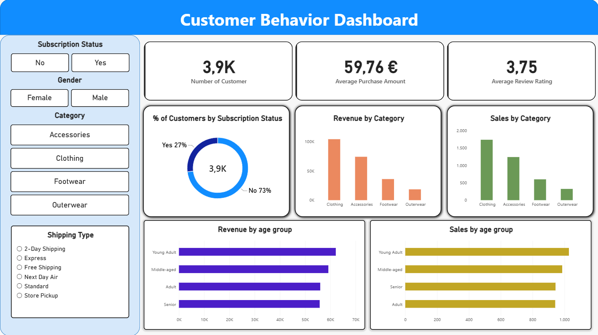

# Customer Shopping Behavior Analysis

Analisi end-to-end del comportamento d'acquisto clienti, dalla pulizia dati in Python fino a una dashboard interattiva in Power BI, passando per un'analisi SQL strutturata su 10 domande di business.

---

## 📌 Business Problem

Un'azienda retail vuole capire meglio il comportamento d'acquisto dei propri clienti per migliorare le vendite, la soddisfazione e la fedeltà nel lungo periodo. Il management ha notato variazioni nei pattern d'acquisto tra fasce demografiche, categorie di prodotto e canali di spedizione, ed è interessato a capire quali fattori — sconti, recensioni, stagionalità, tipo di abbonamento — influenzano le decisioni d'acquisto e gli acquisti ripetuti.

**Domanda di business generale:**

> Come può l'azienda sfruttare i dati sul comportamento d'acquisto per identificare trend, migliorare l'engagement dei clienti e ottimizzare le strategie di marketing e prodotto?

Questo progetto affronta la domanda attraverso tre fasi: pulizia e preparazione dei dati (Python), analisi strutturata su domande di business specifiche (SQL), ed esplorazione visiva interattiva (Power BI).

---

## 📊 Dataset

* **Fonte:** dataset pubblico di comportamento d'acquisto clienti (e-commerce)
* **Righe:** 3.900 transazioni
* **Colonne originali:** 18 → **19 dopo il cleaning** (2 feature aggiunte, 1 colonna ridondante rimossa)
* **Feature principali:**

  * Anagrafica cliente: età, genere, località, stato abbonamento
  * Dettagli acquisto: prodotto, categoria, importo, stagione, taglia, colore
  * Comportamento d'acquisto: sconto applicato, acquisti precedenti, frequenza d'acquisto, rating, tipo di spedizione
* **Valori mancanti:** 37 valori nella colonna `review_rating`, gestiti tramite imputazione con mediana raggruppata per categoria

---

## 🏗️ Architettura del progetto

```
Python (Jupyter Notebook)
        │
        ▼
   Dataset pulito (.csv)
        │
   ┌────┴─────┐
   ▼          ▼
SQL          Power BI
(DB Browser  (dashboard
for SQLite)  interattiva)
```

Il dataset pulito, prodotto in Python, alimenta **due percorsi paralleli e complementari**:

* L'**analisi SQL** risponde a domande di business puntuali, con query mirate e risultati documentati.
* La **dashboard Power BI** offre un'esplorazione visiva e interattiva dello stesso dataset, tramite slicer che permettono di incrociare liberamente le dimensioni chiave.

Non è un flusso sequenziale in cui una fase alimenta l'altra, ma due modalità di analisi complementari sulla stessa fonte dati.

---

## 🐍 Fase 1 — Data Preparation (Python)

Notebook: [`cleaning_data.ipynb`](notebooks/cleaning_data.ipynb)

Strumenti: **Jupyter Notebook locale**, **pandas**

Passaggi principali:

* Esplorazione iniziale (`df.info()`, `df.describe()`, controllo missing e duplicati)
* Imputazione dei 37 valori mancanti in `review_rating` con la **mediana per categoria** (non mediana globale, per preservare le differenze tra categorie)
* Standardizzazione dei nomi colonna in `snake_case`
* Feature engineering:

  * `age_group`: fasce d'età create con `pd.qcut` (quartili), per gruppi bilanciati numericamente
  * `purchase_frequency_days`: conversione della frequenza d'acquisto testuale in un valore numerico di giorni
* Verifica e rimozione della colonna `promo_code_used`, ridondante rispetto a `discount_applied`
* Esportazione del dataset pulito in CSV e in un database SQLite, come base per l'analisi in DB Browser

---

## 🗄️ Fase 2 — SQL Analysis

Strumento: **DB Browser for SQLite**
Query: [`queries.sql`](sql/queries.sql)
Risultati completi: [`results/business_questions.pdf`](results/business_questions.pdf)

10 domande di business analizzate, tra cui: spesa per genere, comportamento sconti, top prodotti per rating e vendite, confronto tipi di spedizione, impatto abbonamento, segmentazione clienti per fedeltà, revenue per fascia d'età.

Ogni domanda di business è seguita da screenshot dell'output e interpretazione del risultato nel PDF dei risultati.

---

## 📈 Fase 3 — Power BI Dashboard

File: [`powerbi/dashboard.pbix`](powerbi/dashboard.pbix)



Dashboard interattiva costruita sul dataset pulito, con:

**KPI Card:**

* Numero clienti
* Importo medio d'acquisto
* Rating medio recensioni

**Grafici:**

* Donut chart: distribuzione clienti per stato abbonamento
* Revenue e volume ordini per categoria
* Revenue e volume ordini per fascia d'età

**Slicer interattivi:** stato abbonamento, genere, categoria, tipo di spedizione — permettono di esplorare liberamente le relazioni tra le dimensioni chiave.

---

## 📁 Struttura repository

```
customer-shopping-behavior-analysis/
├── README.md
├── LICENSE
├── data/
│   ├── customer_shopping_behavior.csv
│   └── cleaned_customer_shopping_behavior.csv
├── notebooks/
│   └── cleaning_data.ipynb
├── sql/
│   └── queries.sql
├── powerbi/
│   ├── dashboard.pbix
│   └── dashboard.png
└── results/
    └── business_questions.pdf
```

---

## 🛠️ Stack tecnico

* **Python:** Pandas, Jupyter Notebook
* **SQL:** SQLite, DB Browser for SQLite
* **Visualizzazione:** Power BI Desktop
* **Versionamento:** Git / GitHub

---

## 👤 Contatti

**Francesco Donato**
[LinkedIn](https://www.linkedin.com/in/francesco-donato-)
